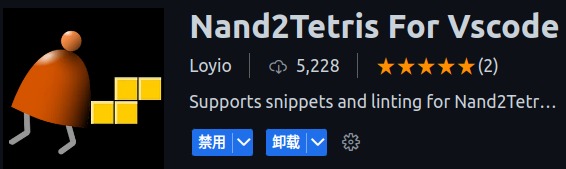

# 项目简介
本项目是我学习《计算机系统要素：从零开始构建计算机》英文名《The Elements of Computing Systems》，完成的课程作业。我使用的开发工具是VS Code，从第6章汇编编译器开始到jack编译器，我使用的是python语言编写的。项目中有个目录【官方资料】，这个目录里存放的是官方提供的工具与资料。

# 学习感悟
我是在2024-02-27那天在阅读《深度学习入门：基于Python的理论与实践》第一章时，它提到了这本书。我一下子就发现这本书就是我一直寻找的可以深度理解计算机的书。并于当天开始学习。到2024-05-10那天，历时2个半月，完成了《计算机系统要素的学习》。

学习这本书的最大感受就时：在看完一章后，感觉理解的模模糊糊，似懂非懂，好像也不是很难；然后，在完成代码实现时，又感觉很茫然，无从下手；最后，经过反复阅读章节提示与思考，终于完成了课程实现后，又感觉难度还可以，也不是特别难。

这本书非常系统非常宽泛，从基础逻辑门一直向上构建，经过ALU、RAM、CPU、计算机构建、汇编编译、VM编译、高级语言编译，直到操作系统实现。能够在区区12章，就达成这些实现，困难可想而知，但作者做到了。而且，也让我们体验到了这一整套经历。在此，感谢作者的贡献，也感谢译者的工作，让英文不好的我也能领略这本书的风采。推荐有一定开发经验的并且对计算机核心感兴趣的人，学习一下这本书，一定会让你终生受益。

当然，我在学习的过程中，还是能因为知识的不足而感受到一些难度的。比如：我就在由真值表到逻辑电路实现中，一直找不到有什么规律可循，一直都在摸索，感觉非常困惑。中途，我又把我曾经阅读过的《穿越计算机的迷雾》这本书找出来，看了一遍。发现，原来从真值表到逻辑表达式再到逻辑电路实现，这些还真是有规律可循。这原来就是香农的贡献。曾经，在百度搜索上看到对香农的纪念。当时还纳闷儿：这个人是谁，他很厉害吗?现在，我知道，他真的很厉害！

# VS插件推荐
#### Nand2Tetris For Vscode
该插件可以帮助实现.out、.tst、.cmp、.jack文件的高亮。

#### Nand2Tetris Tools
该插件可以方便我们对hdl的测试，它可以在我们打开hdl文件后，右上角现实测试按钮，非常方便测试hdl代码。

#### Nand2Tetris
这个插件可以帮助完善jack代码高亮，上面插件`Nand2Tetris For Vscode`虽然能高亮jack代码，但是不够完整，比如函数调用代码的高亮就没有。

#### Nand2Tetris HDL Visualizer
该插件可以实现hdl的可视化显示，可以让我们直观的看到hdl连接情况。

# 感谢与链接
在学习过程中，我有碰到过困难。参考过其他人的项目代码，再次一并表示感谢。他们的项目链接如下：

[js版实现](https://github.com/woai3c/nand2tetris/tree/master)

[python版实现](https://github.com/xrahoo/nand2tetris-python)